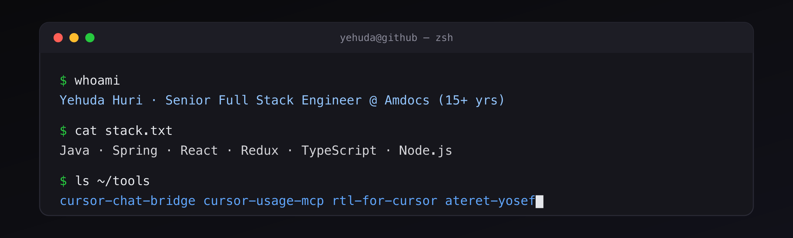

<!--
  GitHub Profile README for github.com/udah1  (Variant B: terminal)
  Lives in the PUBLIC repo named "udah1" as README.md.
  Header is a self-hosted PNG (assets/header-terminal.png) — no external services.
-->

 

## About

Senior Full Stack Developer & System Designer at **Amdocs**, leading complex backend and frontend
efforts with an eye for scalability and usability. I enjoy understanding how things work under the
hood and finding fast, elegant solutions to hard problems — then turning them into tools that
multiply other people's productivity. I also ship full products end-to-end on my own.

B.Sc. in Software Engineering, Ben-Gurion University of the Negev.

## Tech stack

## Products

### [Ateret Yosef — Digital Synagogue Board](https://ateretyosef.org/he/)

A free, full-stack digital-signage platform for synagogues, built end-to-end: an Android TV
display app, a Gabbai mobile management app, and a worshipper-facing mobile view. Location-precise
astronomical engine for daily zmanim, multiple rites, offline-first, and real-time "Red Alert"
(Home Front Command) integration. 100% free, non-profit.

### [LOOZ — Trip Planning + Personal Group App](https://trip-landing-omega.vercel.app/)

A service that plans your trip and ships your group a personal app: day-by-day itinerary,
restaurants, shared expense tracking with automatic debt settlement, real-time alerts, and an
AI travel agent that knows your whole trip. Installable PWA, works offline, Hebrew-first.

### [Ishurit — Event RSVP over SMS & WhatsApp](https://rsvp-saas.vercel.app/)

An RSVP SaaS for weddings and events — send personalized invites by SMS/WhatsApp, collect
confirmations, and track a live dashboard with seating plans. Multilingual (Hebrew / English /
Russian), installable PWA.

### [DevToolsHub — Developer Tools Directory](https://devtoolshub-udah1.vercel.app/)

A directory platform I built for sharing developer tools, extensions, MCPs, rules, and skills —
browse by type, submit your own, and review. Auth, filtering, and ratings included.

## Open source

### [Harmony 2.0 — React/Redux Boilerplate & CLI](https://github.com/Amdocs-Studio/harmony-2.0) &nbsp;·&nbsp; [npm](https://www.npmjs.com/package/harmony2)

Co-created at the Amdocs Experience & Digital Engineering Studio — an `npx`-based CLI that
scaffolds production-ready React/Redux apps (SPA or MPA) with zero config.
TypeScript · Redux Toolkit · Vite · Node.js · TailwindCSS · WebSockets · i18n.

### Cursor & editor tooling

A suite of open-source tools for working with the Cursor AI editor (and VS Code) — squeezing more
out of AI agents, keeping costs down, and making the editor pleasant in any language.

| Project | What it does |
| --- | --- |
| [**cursor-chat-bridge**](https://github.com/udah1/cursor-chat-bridge) &nbsp;·&nbsp; [npm](https://www.npmjs.com/package/cursor-telegram-chat) | Drive the Cursor agent from your phone over Telegram / Discord / GitHub. Pluggable adapters + local daemon + MCP tools + hooks; auto-resumes on reply. |
| [**cursor-usage-mcp**](https://github.com/udah1/cursor-usage-mcp) &nbsp;·&nbsp; [npm](https://www.npmjs.com/package/cursor-usage-optimizer) | A local MCP server that stops the Cursor agent from burning your request quota — reads live usage and hands the agent a `conserve` flag. |
| [**cursor-usage-extension**](https://github.com/udah1/cursor-usage-extension) | A tiny, read-only VS Code / Cursor extension showing live Cursor usage in the status bar & sidebar — no separate login. |
| [**cursor-theater**](https://github.com/udah1/cursor-theater) | Watch your Cursor / Claude agent conversations work — a live "office" visualizer, in real time. |
| [**rtl-for-vs-code-and-cursor-agents**](https://github.com/udah1/rtl-for-vs-code-and-cursor-agents) | Native-like RTL support for AI chat agents (Cursor, Copilot, Claude Code, Codex, Gemini). Optimized for Hebrew, Arabic & Persian; code blocks stay LTR. |

### Browser extensions

| Project | What it does |
| --- | --- |
| [**resource-override-extension**](https://github.com/udah1/resource-override-extension) | A modern, Manifest V3 Chrome extension to redirect requests, mock responses (JSON/JS/CSS), modify response headers, and inject JS/CSS — with a clean UI and per-rule control. |

 

Always learning. Always building. Always aiming to make the next version better than the last.

